# Repository Guidelines

## Project Structure & Module Organization
The CLI entry point lives in `ecosystem-ci.ts`, handling argument parsing, stack selection, and GitHub Actions plumbing. Shared helpers (`runInRepo`, git utilities, bootstrap logic) reside in `utils.ts`, while DTOs are defined in `types.d.ts`. Integration suites are colocated under `tests/<stack>/` (for example `tests/rsbuild/plugins.ts`) and export an async `test(options: RunOptions)` function. Runtime clones are created under `workspace/`; treat this directory as disposable and keep it untracked. The `website/` directory hosts the deployed page, which pulls fresh data from the `data` branch via ecosystem CI rendering before the scheduled deployment jobs run.

## Build, Test, and Development Commands
Use `pnpm install` to bootstrap dependencies (Node ≥18). Run targeted suites with `pnpm test --stack <stack> [suite]`, e.g. `pnpm test --stack rsbuild plugins`. Bisect regressions via `pnpm bisect --stack <stack>`. Execute `pnpm lint` to run `biome check .`. After cloning, `pnpm prepare` installs `simple-git-hooks` so the Biome pre-commit hook fires locally.

## Coding Style & Naming Conventions
Biome enforces space indentation, single quotes, normalized imports, and the shared lint rules. Follow the strict TypeScript settings in `tsconfig.json` (ESNext target, NodeNext resolution, `noImplicitOverride`). Name suite files in lowercase or kebab-case (`tests/rspack/lynx-stack.ts`), keep helpers camelCase, and reserve `test` exports for suite entry points.

## Testing Guidelines
Suites boot via `setupEnvironment` and must remain idempotent so reruns start clean. Prefer `runInRepo` with explicit `repo`, `branch`, `test`, and overrides so reviewers can audit each step. When adding scenarios, mirror the minimal patterns (for example `tests/rsbuild/examples.ts` with `test: ['build:rsbuild']`) and document any required environment tweaks.

## Commit & Pull Request Guidelines
Commits follow short, imperative subjects (≤72 chars), elaborating in the body only when behavior changes. PRs should justify the change, list affected stacks or utilities, and include the exact validation command, e.g. `pnpm test --stack rspack modernjs`. Attach logs or screenshots for CI changes and highlight any new secrets or webhooks reviewers must configure.

## Environment & Tooling Notes
The runner exports `ECOSYSTEM_CI`, `TURBO_FORCE`, and memory-safe `NODE_OPTIONS`; avoid overriding them unless a suite explicitly requires it. Keep `workspace/` untracked, and never commit runtime artifacts. Remember that network-dependent steps may need explicit approval in restricted environments.
`verdaccio.yaml` lives at repo root for rspack flows that publish locally; it writes under `workspace/`.

## Cross-Stack Isomorphism
All stacks (rsbuild, rspack, rslib, rstest, rsdoctor, rspress) must follow the same structural patterns. When fixing a bug or adding a feature to one stack's workflows or shared actions, always check whether the same issue or gap exists in the other stacks and apply the fix uniformly. Avoid stack-specific workarounds that diverge from the common pattern — if a change cannot be made isomorphic, document the reason explicitly. Shared composite actions (`ecosystem_ci_dispatch`, `ecosystem_ci_per_commit`, `ecosystem-ci-result`) and workflow conventions (job naming, Verdaccio setup, suite execution) are designed to be stack-agnostic; keep them that way.

## Execution Flow
All stacks use the same split-repo dispatch model. The **upstream stack repo** (rspack, rsbuild, rslib, rstest, rsdoctor, rspress) calls a composite action hosted in *this* repo, which in turn fires `workflow_dispatch` on a stack-specific workflow (`<stack>-ecosystem-ci-from-pr.yml` / `<stack>-ecosystem-ci-from-commit.yml`) via `convictional/trigger-workflow-and-wait`. When the downstream run finishes, the composite action pulls the job list through `ecosystem-ci-result` and writes the summary back to the upstream PR / commit.

Rspack is the only stack that needs extra setup:
- **`prepare-binding` job** builds (or downloads) the native `.node` artifact before any suite can install `@rspack/*`.
- **`publish-rspack-to-verdaccio` step** bumps every `@rspack/*` package to a fresh sentinel version (`<current>-fresh.<runId>.<runAttempt>`) and publishes it to a local Verdaccio on `http://localhost:4873`, so downstream `pnpm install` deterministically pulls the workspace build instead of falling through the `npmjs` uplink (works around pnpm/pnpm#9270 — see `.github/actions/publish-rspack-to-verdaccio/action.yaml`). The sentinel is then passed to `ecosystem-ci.ts` as `--release`.

### from-pr
Manually triggered to test a PR branch and post the summary back as a PR comment.

```mermaid
flowchart TD
    %% ========================================================================
    %% UPSTREAM — any stack (rspack / rsbuild / rslib / rstest / rsdoctor / rspress)
    %% ========================================================================
    subgraph upstream["Upstream stack repo (any stack)"]
        userDispatch["User dispatches the upstream eco-ci workflow for a PR branch"]
        dispatchAction["ecosystem_ci_dispatch composite action"]
        getPrNumber["get-pr-number: look up PR by branch or explicit input"]
        createComment["create-comment: post Triggered placeholder on the PR<br/>(guarded: if steps.get-pr-number.outputs.result)"]
        dispatchWorkflow["eco_ci: trigger-workflow-and-wait<br/>dispatches stack-ecosystem-ci-from-pr.yml (runs unconditionally)"]
        userDispatch --> dispatchAction --> getPrNumber
        getPrNumber -- "PR located" --> createComment
        createComment --> dispatchWorkflow
        getPrNumber -. no PR located: skip createComment .-> dispatchWorkflow
    end

    %% ========================================================================
    %% DOWNSTREAM — stack-ecosystem-ci-from-pr.yml
    %% Nodes whose id starts with `rspack` are RSPACK ONLY and are skipped
    %% entirely for every other stack. See the bypass edges below.
    %% ========================================================================
    subgraph downstream["rstack-ecosystem-ci — stack-ecosystem-ci-from-pr.yml"]
        %% RSPACK ONLY — dedicated job that builds native bindings before any
        %% execute job can install @rspack/* packages.
        rspackPrepareBinding["RSPACK ONLY — prepare-binding job<br/>prepare-rspack-binding action: checkout upstream @ branchName,<br/>cargo codegen + pnpm build:binding:release,<br/>upload-artifact name=binding-linux-x64-gnu"]

        %% Shared execute-job steps (run for every stack)
        checkoutEcoCi["actions/checkout: clone rstack-ecosystem-ci"]
        buildStackAction["build-stack composite action (build-rspack / build-rsbuild / ...)<br/>setup-node, checkout upstream @ branchName into workspace/stack,<br/>pnpm i + pnpm run build:js inside workspace/stack<br/>(rspack only: download-artifact binding-linux-x64-gnu into workspace/rspack/npm/linux-x64-gnu/)"]
        pnpmInstall["pnpm i --frozen-lockfile (at rstack-ecosystem-ci repo root)"]

        %% RSPACK ONLY — publish workspace build to local Verdaccio with a
        %% fresh sentinel version, then pass it to ecosystem-ci.ts as --release.
        rspackVerdaccioPublish["RSPACK ONLY — publish-rspack-to-verdaccio step<br/>bump to fresh.runId.runAttempt, pnpm publish to localhost:4873"]

        runSuites["pnpm tsx ecosystem-ci.ts run-suites --stack stack [--release sentinel] [--suite-refType ref] suite"]

        rspackPrepareBinding --> checkoutEcoCi --> buildStackAction --> pnpmInstall --> rspackVerdaccioPublish --> runSuites
        pnpmInstall -. non-rspack: skip rspackVerdaccioPublish .-> runSuites
    end

    %% Fork at dispatch: rspack goes through prepare-binding first,
    %% other stacks jump straight into the shared execute job.
    dispatchWorkflow -. rspack .-> rspackPrepareBinding
    dispatchWorkflow -. other stacks .-> checkoutEcoCi

    %% ========================================================================
    %% BACK IN UPSTREAM — summarize and update the PR comment
    %% ========================================================================
    subgraph result["Back in upstream"]
        ecoCiResult["ecosystem-ci-result: fetch downstream jobs, build markdown summary"]
        updateComment["update-comment: overwrite the Triggered comment with the summary<br/>(guarded: if steps.get-pr-number.outputs.result)"]
        noCommentEnd(["no PR located: summary is not written anywhere upstream"])
        ecoCiResult -- "PR located" --> updateComment
        ecoCiResult -. no PR located: skip updateComment .-> noCommentEnd
    end

    runSuites -. run finished .-> ecoCiResult

    %% Visual styling (humans only). Does not change semantics — the `rspack`
    %% node-id prefix and the `RSPACK ONLY` label prefix are authoritative.
    classDef rspack fill:#ffe0b2,stroke:#e65100,stroke-width:3px,color:#000
    class rspackPrepareBinding,rspackVerdaccioPublish rspack
```

### from-commit
Automatically triggered by upstream CI on each push to main; posts a commit comment on failure and feeds successful runs into the website's `data` branch.

```mermaid
flowchart TD
    %% ========================================================================
    %% UPSTREAM — any stack, on push to main
    %% ========================================================================
    subgraph upstream["Upstream stack repo CI — on push to main"]
        upstreamPerCommit["Upstream workflow calls ecosystem_ci_per_commit composite action"]
        dispatchWorkflow["eco_ci: trigger-workflow-and-wait<br/>dispatches stack-ecosystem-ci-from-commit.yml with commitSHA<br/>(rspack workflow additionally accepts sourceRunId + sourceRepo inputs)"]
        upstreamPerCommit --> dispatchWorkflow
    end

    %% ========================================================================
    %% DOWNSTREAM — stack-ecosystem-ci-from-commit.yml
    %% Nodes whose id starts with `rspack` are RSPACK ONLY. Other stacks skip
    %% them via the bypass edges below.
    %% ========================================================================
    subgraph downstream["rstack-ecosystem-ci — stack-ecosystem-ci-from-commit.yml"]
        %% RSPACK ONLY — prepare-binding job with two mutually-exclusive paths
        %% gated by `if: inputs.sourceRunId != ''` / `if: inputs.sourceRunId == ''`
        rspackPrepareBinding["RSPACK ONLY — prepare-binding job<br/>(branches on inputs.sourceRunId)"]
        rspackPrepareBindingPathA["RSPACK ONLY — Path A (sourceRunId != '')<br/>actions/download-artifact name=bindings-x86_64-unknown-linux-gnu<br/>from repo=sourceRepo, run-id=sourceRunId,<br/>then upload-artifact name=binding-linux-x64-gnu"]
        rspackPrepareBindingPathB["RSPACK ONLY — Path B (sourceRunId == '')<br/>prepare-rspack-binding action: checkout upstream @ commitSHA,<br/>cargo codegen + pnpm build:binding:release,<br/>upload-artifact name=binding-linux-x64-gnu"]
        rspackPrepareBinding -- "sourceRunId != ''" --> rspackPrepareBindingPathA
        rspackPrepareBinding -- "sourceRunId == ''" --> rspackPrepareBindingPathB

        %% Shared execute-job steps (run for every stack)
        checkoutEcoCi["actions/checkout: clone rstack-ecosystem-ci"]
        buildStackAction["build-stack composite action (build-rspack / build-rsbuild / ...)<br/>setup-node, checkout upstream @ commitSHA into workspace/stack,<br/>pnpm i + pnpm run build:js inside workspace/stack<br/>(rspack only: download-artifact binding-linux-x64-gnu into workspace/rspack/npm/linux-x64-gnu/)"]
        pnpmInstall["pnpm i --frozen-lockfile (at rstack-ecosystem-ci repo root)"]

        %% RSPACK ONLY — Verdaccio publish; additionally skipped for _selftest
        rspackVerdaccioPublish["RSPACK ONLY — publish-rspack-to-verdaccio step<br/>bump to fresh.runId.runAttempt, pnpm publish to localhost:4873<br/>(additionally skipped when suite == _selftest)"]

        runSuites["pnpm tsx ecosystem-ci.ts run-suites --stack stack [--release sentinel] [--suite-refType ref] suite"]

        rspackPrepareBindingPathA --> checkoutEcoCi
        rspackPrepareBindingPathB --> checkoutEcoCi
        checkoutEcoCi --> buildStackAction --> pnpmInstall --> rspackVerdaccioPublish --> runSuites
        pnpmInstall -. non-rspack or rspack _selftest: skip rspackVerdaccioPublish .-> runSuites
    end

    %% Fork at dispatch: rspack goes through prepare-binding first,
    %% other stacks jump straight into the shared execute job.
    dispatchWorkflow -. rspack .-> rspackPrepareBinding
    dispatchWorkflow -. other stacks .-> checkoutEcoCi

    %% ========================================================================
    %% BACK IN UPSTREAM — commit comment on failure + push to data branch
    %% ========================================================================
    subgraph result["Back in upstream"]
        ecoCiResult["ecosystem-ci-result: fetch downstream jobs, build summary"]
        createCommitComment["createCommitComment on the upstream commit<br/>(guarded: if steps.eco_ci.outcome == 'failure')"]
        updateHistory["update-ecosystem-history.mjs: build data-artifacts payload from results JSON"]
        publishHistory["JamesIves/github-pages-deploy-action<br/>push artifacts to rstackjs/rstack-ecosystem-ci data branch (feeds website/)<br/>(guarded: if steps.update-history.outcome == 'success')"]
        historyFailedEnd(["update-history failed: data branch not updated for this run"])
        ecoCiResult -- "downstream failed" --> createCommitComment
        ecoCiResult --> updateHistory
        updateHistory -- "update-history succeeded" --> publishHistory
        updateHistory -. update-history failed: skip publishHistory .-> historyFailedEnd
    end

    runSuites -. run finished .-> ecoCiResult

    %% Visual styling (humans only). Does not change semantics — the `rspack`
    %% node-id prefix and the `RSPACK ONLY` label prefix are authoritative.
    classDef rspack fill:#ffe0b2,stroke:#e65100,stroke-width:3px,color:#000
    class rspackPrepareBinding,rspackPrepareBindingPathA,rspackPrepareBindingPathB,rspackVerdaccioPublish rspack
```

